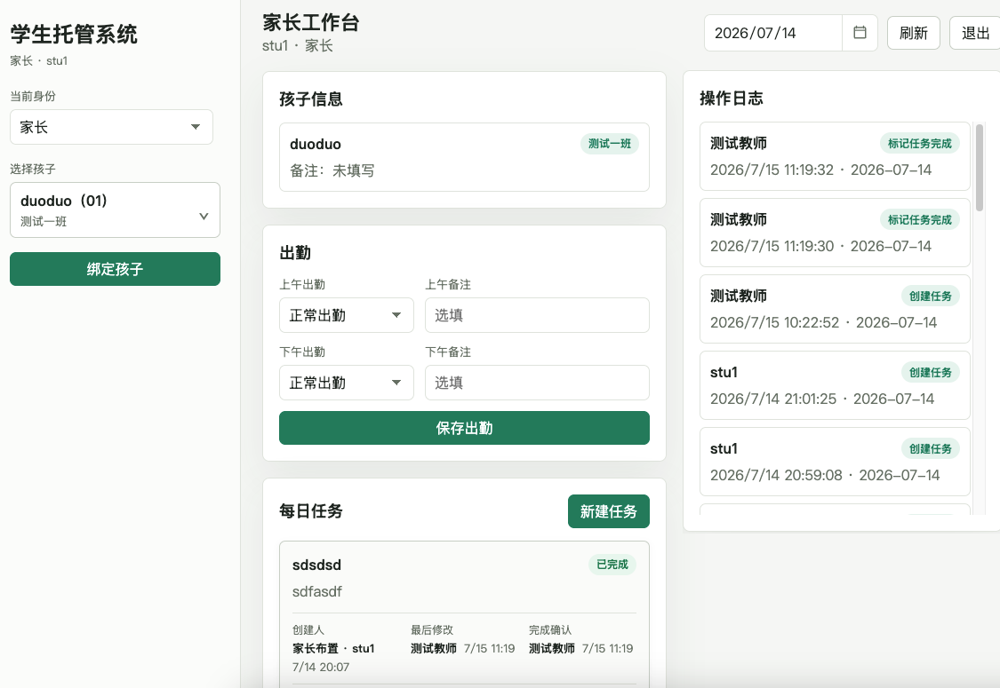
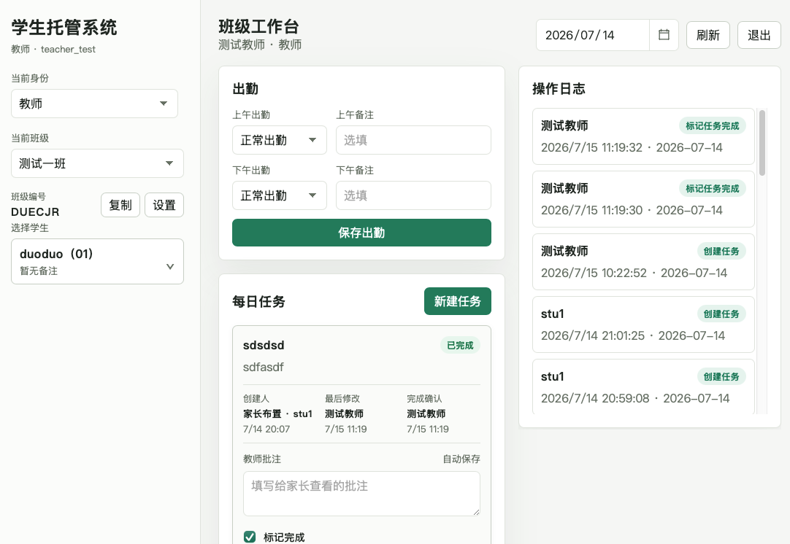
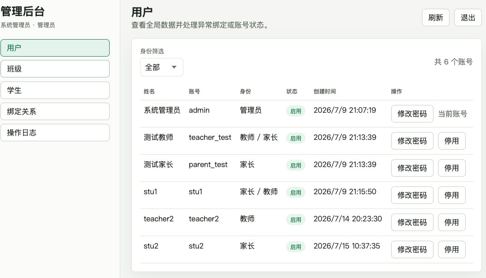

# 学生托管系统

简单 Web 版学生托管系统，后端使用原生 Node.js，数据默认写入 SQLite 数据库 `data/stumng.sqlite`。

普通账号可以同时开通教师、家长身份并切换工作台；班级关系、孩子绑定、最近选择和任务操作权限均按当前身份隔离，适配移动端。

## 启动

```bash
npm run dev
```

开发模式会监听本机所有网络接口。同一局域网内的手机可通过电脑的局域网 IP 访问：

```text
本机：http://127.0.0.1:3000
手机：http://电脑局域网IP:3000
```

手机和电脑需要连接同一局域网；macOS 防火墙弹出提示时，应允许 Node 接收入站连接。`npm start` 仍默认只监听 `127.0.0.1`，生产环境不会因此自动暴露端口。

## 生产部署

推荐使用 Docker Compose 一键部署：

```bash
chmod +x scripts/deploy.sh
./scripts/deploy.sh deploy
```

默认仅监听服务器本机；正式公网部署请先将域名解析到服务器，并使用 `DOMAIN=care.example.com ./scripts/deploy.sh deploy` 自动启用 HTTPS。没有域名且需要临时通过公网 IP 访问时，可使用 `APP_BIND=0.0.0.0 ALLOW_INSECURE_HTTP=true ./scripts/deploy.sh deploy`，但明文 HTTP 不适合长期使用。

完整的服务器准备、HTTPS、配置、备份、恢复和升级说明见 [部署说明](doc/部署说明.md)。

## 管理员配置

管理员不通过注册页面创建。部署时通过环境变量初始化：

```bash
ADMIN_ACCOUNT=admin ADMIN_PASSWORD='Admin!ChangeMe2026' ADMIN_NAME=系统管理员 npm run dev
```

如果管理员账号不存在，服务启动时会自动创建。所有新密码统一要求至少 8 位，且必须包含大写字母、小写字母和特殊符号。已有旧账号仍可使用原密码登录。

可参考 `.env.example` 配置部署环境变量。

## 数据存储

系统使用 SQLite 单文件数据库：

```text
data/stumng.sqlite
```

SQLite 不是加密数据库。部署时应限制服务器文件权限，并做好数据库文件备份；如果后续有强隐私或合规要求，再考虑 SQLCipher 或云数据库托管。

## 测试数据

手动创建一套测试数据：

```bash
npm run seed:test
```

脚本会创建或更新：

- 创建教师：`teacher_owner_test / Test!1234`
- 协同教师：`teacher_helper_test / Test!1234`
- 家长一：`parent_one_test / Test!1234`
- 家长二：`parent_two_test / Test!1234`
- 班级：`测试一班`，班级编号 `TEST01`
- 家长一的孩子：`多多`、`小雨`
- 家长二的孩子：`多多`、`小禾`
- 两个 `多多` 用于验证班级内重名标识
- 每个孩子 2 条默认 `待完成` 任务

脚本是幂等的，重复执行不会无限新增同一批测试数据。

## 开源许可

本项目基于 [MIT License](LICENSE) 开源。


### 界面预览

家长工作台：



教师工作台：



管理后台：


